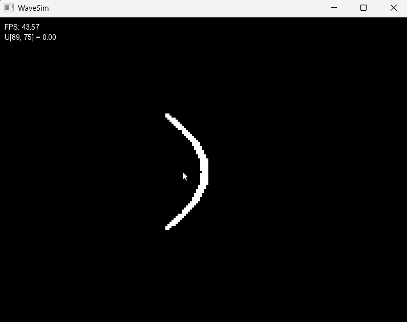

# 🌊 WaveSim


**WaveSim** is a C++ project that visualizes wave phenomena using **SFML**.  
It provides real-time, interactive simulations of:

- **Superposition**  
- **Reflection (parabolic boundary)**  
- **Refraction**  

This project is designed as both an **educational tool** and a **visual playground** for exploring wave mechanics.  

---

## 📽️ Simulations

### 🔹 Reflection (Parabola)


---

### 🔹 Refraction


---

## 🕹️ Controls

During the simulation, you can interact in real time:

- **Spacebar** → Generate a **linear wave**  
- **Left Mouse Click** → Create a **point source wave** at the clicked position  
- **R** → Reset the simulation  

---

## 🛠️ Build Instructions

### Prerequisites
- C++17 or newer  
- [CMake](https://cmake.org/) ≥ 3.10  
- [SFML](https://www.sfml-dev.org/) (linked via CMake / included as dependency)  

### Build
```bash
git clone https://github.com/yourusername/WaveSim.git
cd WaveSim
mkdir build && cd build
cmake ..
make
```

### Run
```bash
./WaveSim
```

---

## ⚙️ Configuration

Some simulation parameters can be customized in **`main.cpp`** by modifying constants:

- **Parabola Reflection** → Enable or adjust the parabolic boundary  
- **Refraction** → Change the relative wave speed in each medium  

Rebuild the project after editing `main.cpp` to apply new settings.  

---

## 📂 Project Structure
```
src/
 ├── main.cpp          # Entry point + simulation parameters
 ├── Renderer.cpp      # Handles SFML rendering
 ├── Wave1D.cpp        # 1D wave equation
 ├── Wave1DInteract.cpp# Interactive 1D simulation
 └── Wave2D.cpp        # 2D wave equation
```

---

## 🤝 Contributing

Contributions are welcome!

---

## 📄 License

This project is licensed under the MIT License – see [LICENSE](LICENSE).  

This project uses [SFML](https://www.sfml-dev.org/).
